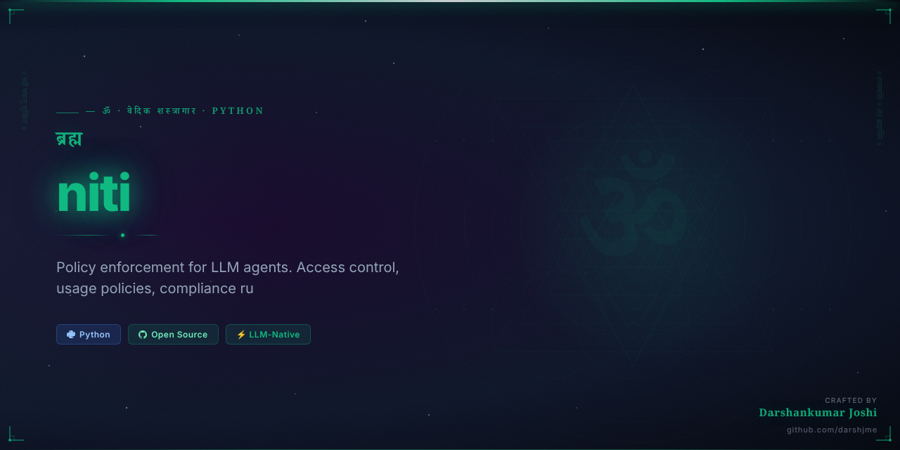

<div align="center">



# 🌿 नीति · `niti`

**Policy-based access control for LLM agents. Define who can do what — and enforce it with a single decorator.**

[](https://pypi.org/project/niti/)
[](https://python.org)
[](https://github.com/darshjme/niti/actions)
[](https://github.com/darshjme/niti)
[](LICENSE)
[](https://github.com/darshjme/arsenal)

*Part of the [**Vedic Arsenal**](https://github.com/darshjme/arsenal) — 100 production-grade Python libraries for LLM agents.*

</div>

---

## Why `niti` Exists

Every production LLM agent needs guardrails. Without policy enforcement, agents read databases they shouldn't touch, write to systems they shouldn't modify, and execute tools without restriction.

`niti` gives you **declarative, runtime-enforced access control** for agent actions — no external services, no schema migrations, no vendor lock-in. You define policies in pure Python, attach them to agent IDs, and let the engine enforce them automatically. The `deny` rule is checked before `allow`, matching how real IAM systems work.

---

## Installation

```bash
pip install niti
```

Or from source:
```bash
git clone https://github.com/darshjme/niti.git
cd niti && pip install -e .
```

---

## Quick Start

```python
from agent_policy import Policy, PolicyEngine, require_permission

# 1. Create a policy engine
engine = PolicyEngine()

# 2. Define a policy: allow db reads, deny db writes
policy = (
    Policy("read-only-policy")
    .allow("database", "read")
    .allow("cache", "read")
    .deny("database", "write")
    .deny("database", "delete")
)

# 3. Attach the policy to an agent
engine.attach("agent-42", policy)

# 4. Check programmatically
result = engine.check("agent-42", resource="database", action="read")
print(result.allowed)   # True
print(result.reason)    # "Allowed by policy 'read-only-policy'"

result = engine.check("agent-42", resource="database", action="write")
print(result.allowed)   # False

# 5. Or guard with a decorator (raises PermissionDeniedError on violation)
@require_permission(engine, agent_id="agent-42", resource="database", action="read")
def fetch_user_records(user_id: str) -> list:
    return db.query(user_id)
```

---

## API Reference

### `Policy`

```python
class Policy:
    """A named collection of allow/deny permission rules.

    Args:
        name: Human-readable policy identifier (used in audit logs and error messages).
    """

    def allow(self, resource: str, action: str, **conditions) -> "Policy":
        """Add an allow rule. Supports wildcard ('*') for resource/action."""

    def deny(self, resource: str, action: str, **conditions) -> "Policy":
        """Add a deny rule. Deny always wins over allow."""
```

### `PolicyEngine`

```python
class PolicyEngine:
    """Central enforcement point. Attach policies to agent IDs and run checks.

    Evaluation order:
        1. If any attached policy explicitly **denies** → denied.
        2. If any attached policy explicitly **allows** → allowed.
        3. Default → denied (fail-closed).
    """

    def attach(self, agent_id: str, policy: Policy) -> None:
        """Attach a policy to an agent. Multiple policies stack."""

    def detach(self, agent_id: str, policy_name: str) -> None:
        """Remove a named policy from an agent."""

    def check(
        self,
        agent_id: str,
        resource: str,
        action: str,
        context: dict | None = None,
    ) -> "PolicyResult":
        """Evaluate whether agent_id may perform action on resource."""
```

### `PolicyResult`

```python
@dataclass
class PolicyResult:
    allowed: bool         # True if the action is permitted
    reason: str           # Human-readable explanation (great for logging)
    agent_id: str
    resource: str
    action: str
```

### `@require_permission`

```python
def require_permission(
    engine: PolicyEngine,
    agent_id: str,
    resource: str,
    action: str,
    context: dict | None = None,
):
    """Decorator that blocks the wrapped function unless the policy allows it.
    Raises PermissionDeniedError on violation."""
```

---

## Real-World Example

Production multi-agent system with tiered access levels:

```python
from agent_policy import Policy, PolicyEngine, PermissionDeniedError

engine = PolicyEngine()

# Analyst agents: read-only across data stores
analyst_policy = (
    Policy("analyst")
    .allow("warehouse", "read")
    .allow("cache", "read")
    .allow("reports", "read")
    .deny("*", "write")
    .deny("*", "delete")
    .deny("secrets", "*")
)

# Executor agents: can write outputs, never touch raw data
executor_policy = (
    Policy("executor")
    .allow("reports", "write")
    .allow("queue", "push")
    .deny("warehouse", "*")
    .deny("secrets", "*")
)

# Superagent: broad access, still locked out of secrets
superagent_policy = (
    Policy("superagent")
    .allow("*", "*")
    .deny("secrets", "*")        # deny always wins
)

engine.attach("analyst-001", analyst_policy)
engine.attach("executor-007", executor_policy)
engine.attach("super-001", superagent_policy)

# Runtime enforcement
for agent_id, resource, action in [
    ("analyst-001",  "warehouse", "read"),    # ✅ allowed
    ("analyst-001",  "warehouse", "write"),   # ❌ denied
    ("executor-007", "reports",   "write"),   # ✅ allowed
    ("super-001",    "secrets",   "read"),    # ❌ denied — explicit deny
]:
    result = engine.check(agent_id, resource, action)
    status = "✅" if result.allowed else "❌"
    print(f"{status} [{agent_id}] {action} on {resource}: {result.reason}")
```

### Conditional Policies

```python
# Only allow DB writes during business hours (pass context at check time)
timed_policy = (
    Policy("business-hours-write")
    .allow("database", "write", time_window="business")
    .deny("database", "write", time_window="off-hours")
)

engine.attach("agent-B", timed_policy)

import datetime
hour = datetime.datetime.now().hour
ctx = {"time_window": "business" if 9 <= hour < 18 else "off-hours"}

result = engine.check("agent-B", "database", "write", context=ctx)
```

---

## The Vedic Principle

*नीति* — Niti (Sacred Ethics / Dharmic Policy) — is the philosophical backbone of Chanakya's *Arthashastra* and the *Nitishastra*. Chanakya understood that governance without policy is chaos: every agent in a system must have explicitly defined duties and boundaries.

`niti` applies this principle to software. Your LLM agents are agents in the classical sense — autonomous actors in a system. Give them a dharma (a policy), and they won't transgress it.

---

## The Vedic Arsenal

`niti` is one of 100 libraries in **[darshjme/arsenal](https://github.com/darshjme/arsenal)** — each named from sacred Indian literature, each solving exactly one problem:

| Library | Source | Purpose |
|---------|--------|---------|
| `niti` | Nitishastra / Chanakya | Policy enforcement |
| `smriti` | Vedic Smriti tradition | Agent caching |
| `duta` | Ramayana — Sundarakanda | Task dispatch |
| `kala` | Mahabharata BG 11.32 | Timeout management |
| `raksha` | Ramayana — Sundarakanda | Agent security |

---

## Contributing

1. Fork the repo
2. Create a feature branch (`git checkout -b fix/your-fix`)
3. Add tests — zero external dependencies only
4. Submit a PR

All contributions must maintain the zero-dependencies invariant.

---

## License

MIT © [Darshankumar Joshi](https://github.com/darshjme)

---

<div align="center">

**🌿 Built by [Darshankumar Joshi](https://github.com/darshjme)** · [@thedarshanjoshi](https://twitter.com/thedarshanjoshi)

*"कर्मण्येवाधिकारस्ते मा फलेषु कदाचन"*
*Your right is to action alone, never to its fruits. — Bhagavad Gita 2.47*

[Vedic Arsenal](https://github.com/darshjme/arsenal) · [GitHub](https://github.com/darshjme) · [Twitter](https://twitter.com/thedarshanjoshi)

</div>
